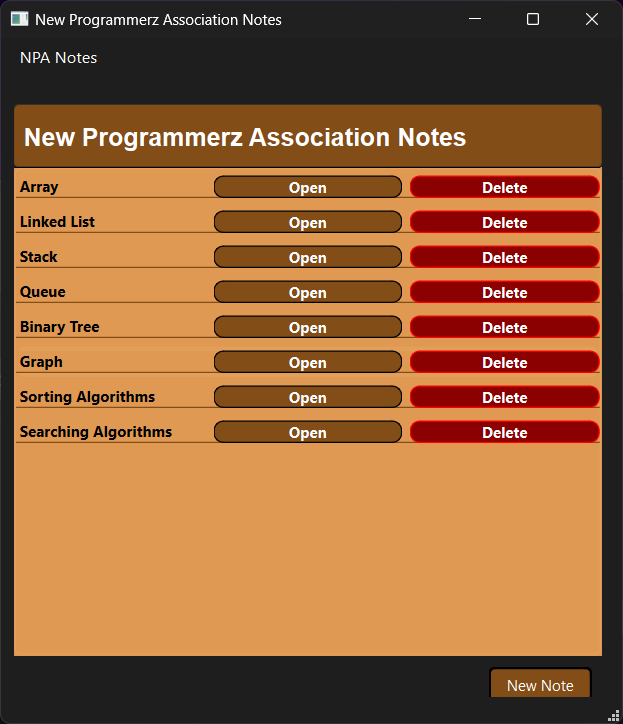
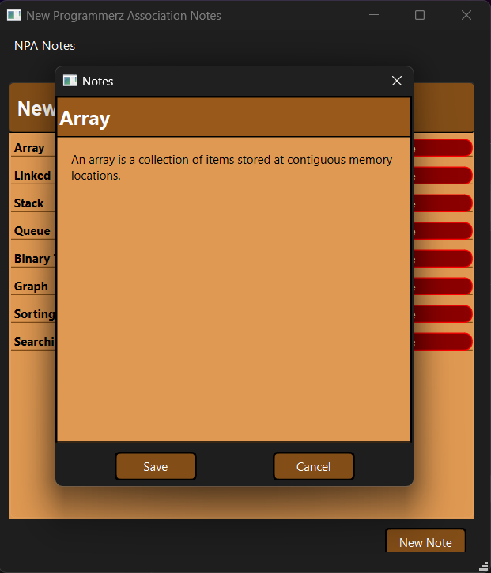

# Notes-CP103-MidtermProject

This is a C++ Qt-based application for managing notes. The application allows users to add, view, and delete notes. Each note consists of a title and a body. The application also includes some hardcoded notes about data structures and algorithms for demonstration purposes.

## Features

- Add new notes
- View and edit existing notes
- Delete notes
- Preloaded notes about data structures and algorithms

## Prerequisites

- Windows operating system
- The application is built using Qt, and all necessary dependencies have been included using `windeployqt`.

## Installation

1. **Download the Release Build:**
   - Go to the [Release](https://github.com/lucifron28/Notes-App-CP103-MidtermProject/tree/master/release) section of the GitHub repository.
   - Download the latest release build (`Notes-CP103-MidtermProject.zip`).

2. **Extract the Zip File:**
   - Extract the contents of the downloaded zip file to a directory of your choice.

## Running the Application

1. **Navigate to the Extracted Directory:**
   - Open File Explorer and navigate to the directory where you extracted the zip file.

2. **Run the Executable:**
   - Double-click on `Notes-CP103-MidtermProject.exe` to run the application.

## Usage

- **Add a Note:**
  - Click the "Add" button to add a new note. A new note with the title "New Note" will be added to the list.
  
- **View/Edit a Note:**
  - Click the "Open" button next to a note to view or edit its title and body. Make your changes and click "Save" to update the note.

- **Delete a Note:**
  - Click the "Delete" button next to a note to remove it from the list.

## Screenshots

*Screenshot of the main window with preloaded notes.*
